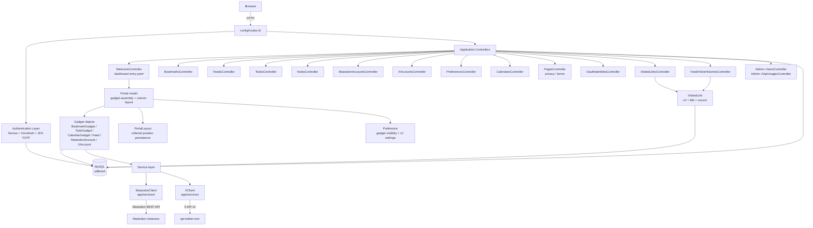

<!-- generated-by: gsd-doc-writer -->
# Architecture

## System Overview

Bookmarks is a personal information dashboard built as a Rails 8.1 monolith. Authenticated users manage bookmarks (tree-structured URLs with folders via `acts_as_tree`), RSS/Atom feeds, todos, notes, a monthly calendar, Mastodon account timeline previews, and X (Twitter) timeline previews, all displayed on a configurable portal page composed of widget-style gadgets arranged in resizable columns. Clicks on feed, X, and Mastodon gadget links are recorded as `VisitedLink` rows (URL plus optional title and source) and, when enabled, listed on a paginated reading-history page. Guests see a landing page at `/`. Data is stored in MySQL; external API communication is handled by two plain-Ruby service objects (`MastodonClient`, `XClient`) using Faraday, and feed fetching uses `Daddy::HttpClient` with Feedjira. The architectural style is a classic layered Rails MVC monolith with a gadget composition system on top.

## Component Diagram



## Data Flow

A typical authenticated dashboard request follows this path:

1. The browser sends `GET /` to the Rails router which dispatches to `WelcomeController#index`.
2. `ApplicationController` runs `before_action :authenticate_user!` (Devise). `WelcomeController#index` skips this via `skip_before_action` and instead checks `user_signed_in?` internally, returning early for guests. If 2FA is enabled the session must already hold a completed OTP challenge — `otp_user_id` is deleted after `Users::TwoFactorAuthenticationController#verify` succeeds.
3. The `Localization` around-action resolves the active locale from (in priority order): `?locale=` query param, saved `Preference#locale`, guest session, or `Accept-Language` header.
4. `WelcomeController#index` loads `current_user.portals.first` which retrieves the user's default `Portal`.
5. The `Portal` model calls the private `get_gadgets` method, which reads `Preference` flags (`use_bookmark?`, `use_todo?`, `use_calendar?`) and collects active `Feed`, `MastodonAccount`, and selected `XAccount` rows. `BookmarkGadget`, `TodoGadget`, `CalendarGadget`, and `Feed` expose `gadget_id` plus `entries`; `MastodonAccount` and `XAccount` expose `gadget_id` (and a title) and load timeline items later via their `show` actions.
6. `Portal#portal_columns` distributes gadgets into 3 or 4 columns according to `PortalLayout` rows ordered by `column_no, display_order`. Gadgets without saved layout rows are placed via round-robin `unshift` into columns.
7. The view renders gadget shells. Feed, calendar, Mastodon, and X gadgets register with `portalLazy` (`app/assets/javascripts/portal_lazy.js`): on desktop they XHR immediately; on viewports `max-width: 767px` they load when that column becomes active. `GET /feeds/:id` parses the remote feed with `Daddy::HttpClient` + Feedjira; `GET /mastodon_accounts/:id` and `GET /x_accounts/:id` call `MastodonClient` / `XClient`; `GET /calendars/get_gadget` returns the calendar fragment. Those `show` actions preload `@visited_urls` for the current gadget's entry URLs only (`assign_visited_urls` in `FeedsController`, `MastodonAccountsController`, and `XAccountsController`) so `ApplicationHelper#visited_link_class` can add `link--visited`.
8. Notes are loaded separately: the portal view triggers `GET /notes/gadget` (XHR, no layout) when the notes tab is opened. The `use_note` preference flag controls notes tab visibility.
9. Clicks on feed, X, and Mastodon gadget links (not bookmark or todo gadgets) POST to `/visited_links`. `visited_links.js` sends `url` plus `title` and `source` (`feed`, `x`, or `mastodon`); `VisitedLinksController#create` calls `VisitedLink.record!`, which upserts on `(user_id, url)` and stores title/source only for those history sources.
10. Portal column state is saved asynchronously via `POST /welcome/save_state` (XHR) whenever the user reorders gadgets, updating `PortalLayout` rows inside a transaction.

When `Preference#use_feed_article_histories?` is on, the header (Modern/Classic themes) or drawer menu (Simple theme) links to `GET /feed_article_histories`. `FeedArticleHistoriesController#index` returns 404 if the flag is off; otherwise it pages `VisitedLink.feed_history_for(current_user)` (rows whose `source` is `feed`, `x`, or `mastodon`, newest `visited_at` first) with Kaminari. Each row renders the stored title (falling back to the URL), a source icon, the link, and a `visited_at` timestamp.

For OAuth sign-in: browser → OmniAuth provider redirect → `Users::OmniauthCallbacksController#<provider>` → `User.from_omniauth` (find or create) → Devise `sign_in_and_redirect` → root path.

For 2FA sign-in: Devise `Users::SessionsController` validates password → stores `otp_user_id` in session → redirects to `Users::TwoFactorAuthenticationController#show` → user submits TOTP code → `user.validate_and_consume_otp!` → full Devise sign-in → root path.

For 2FA setup: authenticated user visits `Users::TwoFactorSetupController#show` → scans QR code → submits TOTP via `#enable` → `Preference#use_two_factor_authentication` is set; disable via `#disable`.

## Key Abstractions

| Abstraction | File | Description |
|---|---|---|
| `Gadget` | `app/models/concerns/gadget.rb` | Concern that defines the dashboard widget interface: `gadget_id`, `entries`, `visible?`. Only `BookmarkGadget` includes this concern. Other gadget objects (`TodoGadget`, `CalendarGadget`, `Feed`, `MastodonAccount`, `XAccount`) implement a duck-typed subset (`gadget_id`, and `entries` where the object itself holds the list). |
| `Bookmark` | `app/models/bookmark.rb` | User-scoped URL or folder node. Uses `acts_as_tree` for hierarchical folders (`url` blank) and bookmark files (`url` present). Included in `Crud::ByUser`. |
| `Crud::ByUser` | `app/models/crud/by_user.rb` | Module adding `readable_by?`, `updatable_by?`, `deletable_by?` for user-scoped ownership. Included by `Bookmark`, `Feed`, `Note`, `Todo`, `MastodonAccount`, `XAccount`. |
| `Localization` | `app/controllers/concerns/localization.rb` | Controller concern that wraps each action in `I18n.with_locale` using a multi-source locale resolution chain (params → preference → guest session → `Accept-Language`). |
| `Portal` | `app/models/portal.rb` | Assembles the set of active gadget objects from user data and `Preference` flags, then distributes them into ordered columns using `PortalLayout` records. Central coordinator of the dashboard. |
| `PortalLayout` | `app/models/portal_layout.rb` | Persists `column_no` and `display_order` for each `gadget_id` per user. Updated by `Portal#update_layout` (called from `WelcomeController#save_state`) on drag-and-drop or column reorder. |
| `Preference` | `app/models/preference.rb` | Per-user settings: active gadgets (`use_bookmark`, `use_todo`, `use_calendar`, `use_note`), reading history (`use_feed_article_histories`), theme, font size, locale, portal column count (3 or 4), column widths (JSON array summing to 100), and link behaviour flags. |
| `VisitedLink` | `app/models/visited_link.rb` | Per-user upsert of visited URLs on unique `(user_id, url)` with fragment-stripped URLs. History sources `feed`, `x`, and `mastodon` also store `title` and `source`; `feed_history_for` powers the reading-history page. Legacy rows without `source` can be backfilled via `backfill_history_sources!` (migration `20260921140000`). Written by `VisitedLinksController#create` via `record!`. |
| `MastodonClient` | `app/services/mastodon_client.rb` | Plain-Ruby Faraday client for the public Mastodon REST API (read-only, no OAuth). Looks up an account via `/api/v1/accounts/lookup` then fetches recent statuses. Returns `{ success:, items: }` result hashes. |
| `XClient` | `app/services/x_client.rb` | Plain-Ruby Faraday client for the X API v2. Authenticates with the user's OAuth 2.0 Bearer token against `api.twitter.com` and refreshes tokens via `api.x.com`. Exposes `fetch_following`, `fetch_recent_tweets`, and `lookup_user_by_username`. |
| `OauthIdentity` | `app/models/oauth_identity.rb` | Joins a `User` to one or more OAuth provider identities (google\_oauth2, twitter2, facebook, mastodon). Upserted via `OauthIdentity.upsert_for!`. Disconnect is guarded: the last authentication method cannot be removed. |
| `XApiCall` | `app/models/x_api_call.rb` | Append-only audit log of every X API call (endpoint, success flag, error code, rate-limit remaining). Exposed to admins via `Admin::XApiUsagesController`. |

## Directory Structure Rationale

```
app/
  controllers/
    admin/           # User list + hard-purge; X API usage report (admin-only)
    users/           # Devise overrides: sessions, OmniAuth callbacks, 2FA sign-in/setup,
                     # email registration, Mastodon instance selection, account deletion
    concerns/        # Localization (locale resolution), TwitterLinkRequirement
  models/
    concerns/        # Gadget interface concern; shared model-level mixins
    crud/            # Crud::ByUser — user-scoped ownership methods
  services/          # External HTTP clients: MastodonClient, XClient (Faraday)
                     # Input normalizers: MastodonHandleNormalizer, MastodonInstanceNormalizer
  views/
    welcome/         # Portal/dashboard view and all gadget partials
    feed_article_histories/  # Paginated reading-history page
    admin/           # Admin-only views
    devise/          # Devise sign-in (sessions/new) and registration (registrations/new)
    users/           # 2FA, email registration, Mastodon instance, account deletion
  helpers/           # ApplicationHelper: changelog entries, visited-link CSS class
  channels/
    application_cable/ # ActionCable base Connection (no custom channels active)
  jobs/              # ApplicationJob base (no background jobs currently defined)
  mailers/           # ApplicationMailer base (Devise manages its own mailers)
  assets/            # Sprockets JS/CSS; themes under stylesheets/themes/;
                     # visited_links.js records gadget-link clicks; portal_lazy.js
                     # defers column XHRs on mobile
config/
  routes.rb          # All routes; guards model loading for dad:setup tasks
  application.rb     # AR Encryption keys, timezone (Tokyo), i18n (ja default, ja+en)
  initializers/      # Devise configuration, OmniAuth provider registration, Kaminari
  app_config.yml     # OmniAuth client IDs/secrets and other app-level config
  environments/      # Per-environment overrides (development, test, production)
lib/
  omniauth/
    strategies/      # Custom Mastodon OAuth2 strategy with dynamic instance
                     # registration and per-request app credential lookup
db/
  schema.rb          # Authoritative MySQL schema (utf8mb4); version 2026_09_21_140000
features/            # Cucumber E2E feature files (run via bundle exec rake dad:test)
test/                # Minitest unit and integration tests
```

The `app/services/` layer isolates most external HTTP calls and input normalization behind plain Ruby objects. `BookmarksController#fetch_title` is an exception: it instantiates Faraday and GETs the submitted URL to extract an HTML title. Gadget value objects (`BookmarkGadget`, `TodoGadget`, `CalendarGadget`) are not ActiveRecord models — they wrap database query results for portal rendering without adding persistence. Only `BookmarkGadget` includes the `Gadget` concern; `TodoGadget` and `CalendarGadget` define their interface methods directly. Feed, Mastodon, and X gadgets render a loading shell on the portal and fill it via XHR so remote fetches stay off the initial dashboard request. `VisitedLink` is the shared store for both the `link--visited` CSS class on those gadget lists and the optional reading-history page. The Mastodon OAuth strategy lives in `lib/` rather than a gem because it requires dynamic per-request Mastodon instance registration, which differs from the static client configuration used by standard OmniAuth strategies.

## Related Docs

- [Getting Started](GETTING-STARTED.md)
- [Development](DEVELOPMENT.md)
- [Configuration](CONFIGURATION.md)
- [API Routes](API.md)
- [Testing](TESTING.md)
